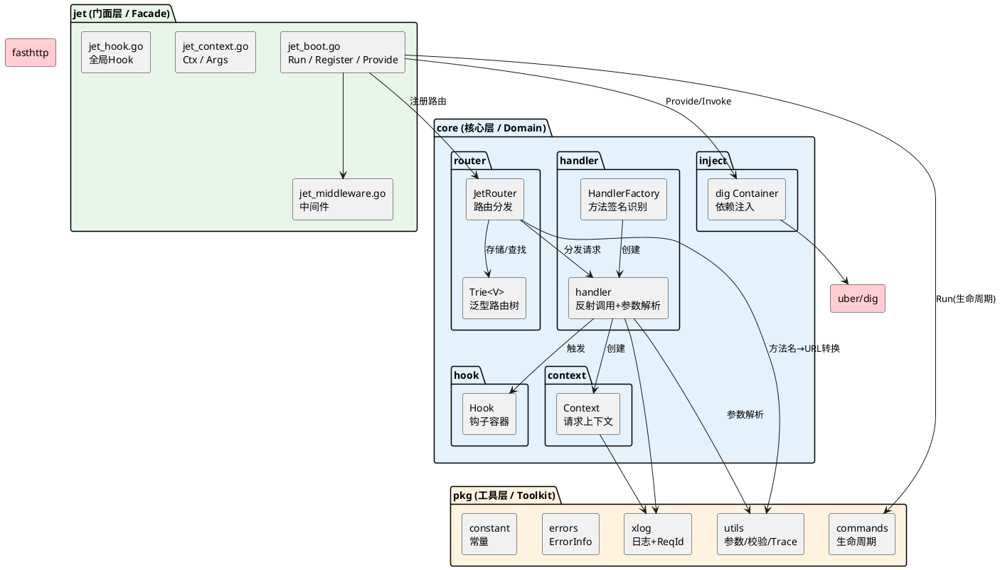
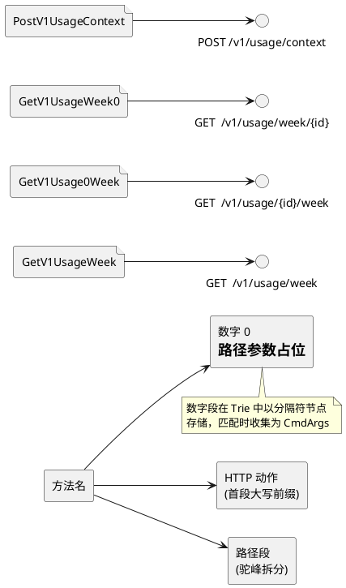
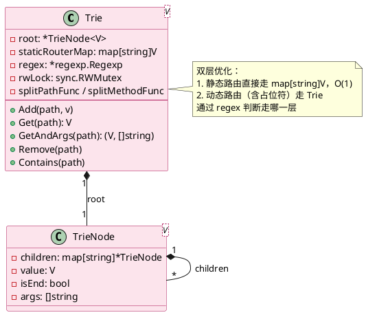
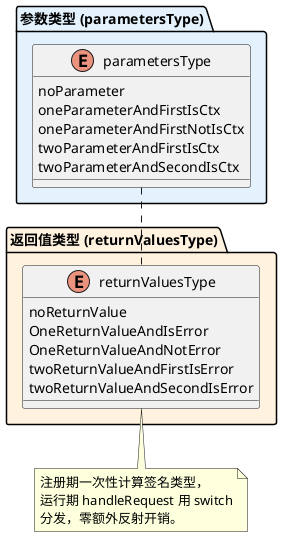
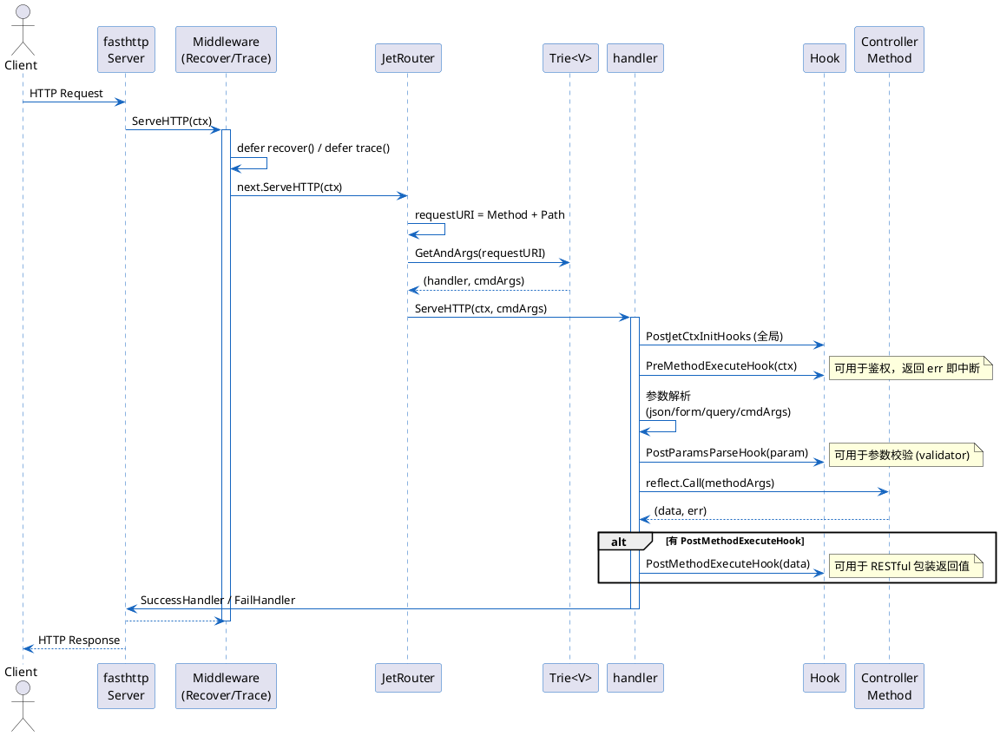
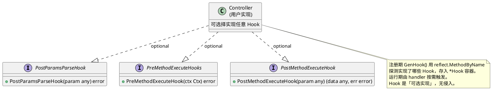
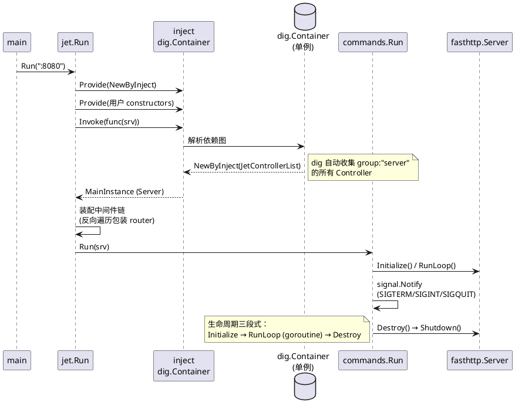

# Jet Web 框架架构分析

> 基于 `jet-web-fasthttp` 源码梳理，涵盖整体架构、设计亮点与扩展性改进建议。

---

## 一、项目概览

Jet 是一款基于 [fasthttp](https://github.com/valyala/fasthttp) 的 Go Web 框架，核心理念与 gin、echo 等「显式注册路由」的框架不同，它走的是 **约定式路由 + 反射绑定 + 依赖注入** 的路线：

| 维度 | 设计选择 |
|------|----------|
| 路由 | 方法名即路由（`GetV1UsageWeek` → `GET /v1/usage/week`） |
| 参数绑定 | 反射自动注入到方法签名（ctx / struct / args） |
| 依赖注入 | 基于 `go.uber.org/dig` |
| 钩子 | 接口式 Hook（PostParamsParse / PreMethodExecute / PostMethodExecute） |
| 底层引擎 | fasthttp（高性能，零内存分配导向） |
| 路由树 | 自研泛型 Trie + 静态路由 Map 双层优化 |

基准表现（README 提供）：`ab -c 400 -n 20000` 下 QPS ≈ **12041**，二进制 14MB，运行内存约 6MB。

---

## 二、整体架构

### 2.1 分层架构

项目采用**门面 + 核心 + 工具包**的三层结构，遵循六边形架构的思想（核心不依赖外部适配器）。



**依赖方向**：`jet → core → pkg → 外部依赖`，单向依赖，无环。门面层只是核心层的薄封装。

### 2.2 目录结构

```
jet-web-fasthttp/
├── jet/                      # 门面层：对外暴露的 API（Run/Register/Provide/Middleware）
│   ├── jet_boot.go           #   启动入口、ControllerResult、BaseJetController
│   ├── jet_context.go        #   Ctx 接口、Args
│   ├── jet_middleware.go     #   Trace/Recover 中间件
│   └── jet_hook.go           #   全局 Hook 注册
├── core/                     # 核心层：框架内核
│   ├── handler/              #   反射处理器（签名识别、参数解析、返回值处理）
│   ├── router/               #   Trie 路由树 + 方法名映射
│   ├── hook/                 #   Hook 容器与触发
│   ├── inject/               #   dig 依赖注入封装
│   └── context/              #   请求上下文
├── pkg/                      # 工具层：可独立复用的工具包
│   ├── xlog/                 #   自研日志（带 ReqId）
│   ├── commands/             #   生命周期（Initialize/RunLoop/Destroy）
│   ├── utils/                #   JSON/校验/fasthttp trace/参数解析
│   ├── errors/               #   带堆栈的 ErrorInfo
│   └── constant/             #   常量与类型判断
└── go.mod                    # go 1.18（启用了泛型）
```

---

## 三、核心机制详解

### 3.1 约定式路由：方法名 → URL

Jet 最具辨识度的设计。Controller 方法名经驼峰拆分后映射为 RESTful 路由：



转换逻辑在 `core/router/router_utils.go`：
- `prefixOf()` 取首个大写字母序列作为 HTTP 动词（GET/POST/PUT/DELETE）
- `splitCamelCaseFunc()` 按大写字母切分剩余部分为路径段
- `ConvertToURL()` 将大写转 `/小写`

路由注册时若方法名以 `0`（或其他配置的 separator）出现，则在 Trie 中插入一个**占位节点**，运行期把实际路径段收集进 `CmdArgs`。

### 3.2 路由树：泛型 Trie + 静态 Map



设计亮点：
- **静态/动态分层**：`Trie.Add` 先用正则判断路径是否含分隔符（动态标记），无则进 `staticRouterMap`（O(1) 命中），有则进 Trie 树
- **泛型**：`Trie[V any]`，Go 1.18 泛型支持，handler 侧复用同一数据结构
- **并发安全**：`sync.RWMutex` 保护所有读写，并提供了 `TestTrieConcurrentAccess` 等并发测试
- **基准数据**（README）：`Get` ≈ 77.9 ns/op，2 allocs/op

### 3.3 反射处理器：方法签名自动识别

`HandlerCreator.New()` 在注册期用反射分析每个 Controller 方法的签名，归类为有限的几种组合，避免运行期重复反射：



`handler.handleRequest()` 按签名类型完成：参数解析 → Pre Hook → 反射调用 → Post Hook → 返回值序列化。这一步把「方法签名 → 处理策略」的映射固化在注册期，是整个框架性能的关键。

### 3.4 请求处理全链路



### 3.5 Hook 系统

Jet 的 Hook 是**接口式 + 方法名反射**的混合实现：



三种 Hook 覆盖了 AOP 的「前置 / 环绕 / 后置」语义，且 `BaseJetController` 提供了默认实现（参数校验 + RESTful 包装），用户继承即可获得开箱即用的能力。

### 3.6 依赖注入与生命周期



---

## 四、设计亮点

### ✅ 1. 约定式路由，极大降低样板代码
方法名即路由声明，无需手动 `r.GET("/v1/usage/week", handler)`。Controller 内聚路由定义，可读性强，重构路径时只改方法名。

### ✅ 2. 注册期固化签名策略，运行期零额外反射
`HandlerCreator.New()` 把方法签名归类为 5×5 的有限组合，运行期 `handleRequest` 只做一次 `switch`，避免每次请求都做反射类型推断。这是高性能的关键。

### ✅ 3. 路由树静态/动态双层优化
静态路由走 `map[string]V`（O(1)），动态路由走 Trie。`Get` 基准 77 ns/op，且并发测试齐全。

### ✅ 4. 泛型 Trie（Go 1.18）
`ITrie[V any]` 抽象 + `Trie[V]` 实现，handler 侧复用同一结构，类型安全。

### ✅ 5. 接口式 Hook，低侵入
Hook 是可选接口，Controller 不实现就不触发；`BaseJetController` 提供默认实现（参数校验 + RESTful 包装），继承即用。

### ✅ 6. dig 依赖注入解耦
`ControllerResult{dig.Out}` + `JetControllerList{dig.In}` + `group:"server"` 自动聚合所有 Controller，用户用 `init() + jet.Provide` 即可零配置注册，符合「约定 + 自动装配」理念。

### ✅ 7. 优雅关闭
`commands.Run` 监听 `SIGTERM/SIGINT/SIGQUIT`，调用 `fastHttpServer.Shutdown()`，配合最近的 commit（graceful shutdown）已形成完整闭环。

### ✅ 8. 请求级 ReqId 链路追踪
每个请求生成 12 位 base64 ReqId，注入到 `xlog.Logger`，全链路日志可串联。

### ✅ 9. 参数绑定覆盖面广
`handler_util.go` 的 `parseValue` 支持：query 单值/多值 slice/map、form、json body、uri cmd args、嵌套 struct、`Has<Field>` 存在性标记、自定义 `ParseValue` 方法。

### ✅ 10. 可扩展的 HandlerFactory
`HandlerFactory.RegisterFactory()` 允许替换或新增 HTTP 动词的处理器工厂，保留了扩展点（虽然尚未被外部使用）。

---

## 五、扩展性改进建议

按「影响面 × 实现成本」排序，从高到低。

### 🔧 1. 路由表达能力受限（高影响）

**现状**：只支持数字 `0` 作为单段占位符，不支持：
- 命名参数 `/users/:id`
- 多段通配符 `/assets/*filepath`
- 正则约束 `/users/:id<\d+>`
- 路由前缀分组（README 已列入 TODO）

**建议**：
- 引入 `:` 命名参数语法，`CmdArgs` 升级为 `map[string]string` 命名参数表，保留旧 `0` 语法做兼容
- 支持 Controller 级路由前缀（通过 struct tag 或 `PreRouteSetupHook` 配置）
- Trie 节点增加 `isWildcard` 标记，支持 `*` 多段匹配

### 🔧 2. Handler 参数硬限制为 2 个（中高影响）

**现状**：`handler_creator.go` 中 `methodNumIn > 2` 直接 `syscall.EINVAL`。

**建议**：放开到 N 个参数，对每个参数按类型（Ctx / struct / 内置类型）分别解析。当前限制会迫使复杂接口把多个参数硬塞进一个 struct。

### 🔧 3. Hook 依赖字符串反射，无编译期保障（中影响）

**现状**：`GenHook` 用 `rcvr.MethodByName("PostParamsParseHook")` 按方法名查找，方法名拼写错误不会被编译器捕获；方法签名错了也只有运行期才暴露。

**建议**：
- 已有 `hook_router.go` 定义了接口（`PostParamsParseHook` 等），但 `GenHook` 没用类型断言而是用字符串反射。建议改为类型断言：

```go
if h, ok := rcvr.Interface().(PostParamsParseHook); ok {
    hook.PostParamsParseHooks = append(..., h.PostParamsParseHook)
}
```
  这样签名错误在编译期即可发现。

### 🔧 4. 全局单例过多，难以测试与多实例（中影响）

**现状**：`container`、`DefaultJetRouter`、`middlewares`、`fastHttpServer`、`PostJetCtxInitHooks`、`localAddr` 均为包级全局变量。

**影响**：
- 无法在单进程内启动多个 Jet 实例（如多端口、灰度）
- 单元测试间状态泄漏
- 全局 `PostJetCtxInitHooks` 的 append 非并发安全

**建议**：引入 `Jet` struct 持有这些状态，`Run` 作为其方法；保留包级 API 作为操作默认实例的便捷入口（`DefaultJet`）。

### 🔧 5. 中间件模型简陋（中影响）

**现状**：
- 中间件签名返回 `error` 但 `Run` 中忽略了 err（`if err == nil` 静默丢弃）
- 执行顺序「后添加先执行」反直觉，README 需要专门解释
- 无法精确控制「全局 / 路由组 / 单个路由」三级中间件作用域

**建议**：
- 中间件 error 应中断链路并统一错误处理
- 顺序改为「先添加先执行」（或提供显式 `Use`/`UseReverse` 两套 API）
- 支持路由组级中间件（依赖前缀分组能力）

### 🔧 6. Context 未集成标准库 `context.Context`（中影响）

**现状**：`Ctx` 接口没有 `Deadline()/Done()/Err()/Value()`，无法用 `context.WithTimeout` 做请求级超时，也无法向下游 RPC/DB 传播取消信号。

**建议**：让 `Context` 嵌入 `context.Context`，并在 `handleRequest` 中注入 `ctx context.Context`（可由 fasthttp 的 `WithUserValue` 承载）。这是接 DB/Redis/HTTP 客户端时跨层超时控制的基础。

### 🔧 7. 错误处理偏重 panic（低中影响）

**现状**：`inject.Provide/Invoke`、`Trie.keyCheck`、`Run(inst==nil)` 均直接 panic。框架启动期 panic 可接受，但 `Invoke` 在运行期被用户调用时会崩进程。

**建议**：区分启动期（panic 合理）与运行期（返回 error）。`keyCheck` 改为返回 error 或在 `Add` 时即校验。

### 🔧 8. 可观测性基础设施缺失（中影响）

**现状**：
- 无 Prometheus metrics（README 列为 TODO）
- 日志为文本格式，无结构化（JSON）输出
- ReqId 仅在本服务日志，未通过 HTTP header（如 `X-Request-Id`）向上下游传播

**建议**：
- 中间件层注入/解析 `X-Request-Id`
- 提供 `/metrics` 端点与默认 RED 指标（Rate/Errors/Duration）
- xlog 增加 JSON encoder 选项，便于 ELK/Loki 采集

### 🔧 9. 配置硬编码（低影响）

**现状**：`ServerSoftware: "JetServer"`、`":8080"` 默认、Content-Type 等散落各处，无统一配置。

**建议**：引入 `Config` struct（监听地址、Server 名、读超时、写超时、最大连接数等），支持从文件/env 加载。

### 🔧 10. 测试覆盖不均（低影响）

**现状**：Trie 有完整单测 + 并发测 + 基准；但核心的 `HandlerCreator`（签名识别）、`handleRequest`（参数解析与 Hook 触发）、`parseValue`（参数绑定）几乎没有单测，主要靠 `jet_boot_test.go` 的端到端启动验证。

**建议**：为反射处理器补充表驱动单测，覆盖所有 `parametersType × returnValuesType` 组合，防止回归。

---

## 六、编码层面的具体问题

### ⚠️ 1. `AddHook` 使用值接收者（潜在隐患）

`handler_creator.go:38`：

```go
func (h handler) AddHook(hooks *hook.Hook) {  // 值接收者
    h.hook.PostParamsParseHooks = append(h.hook.PostParamsParseHooks, ...)
```

当前因为 `hook` 字段是指针 `*hook.Hook`，append 结果通过共享指针写回，**侥幸正确**。但这违反 Go 惯例——「会修改接收者状态的方法应使用指针接收者」。一旦未来有人新增非指针的可变字段，这里会变成隐蔽 bug。

**建议**：改为 `func (h *handler) AddHook(...)`，同时 `IHandler` 的动态类型本就是 `*handler`。

### ⚠️ 2. `FailHandler` 未设置 HTTP 状态码

`handler_util_http.go:37`：

```go
func FailHandler(ctx *fasthttp.RequestCtx, data string) {
    ctx.Response.Header.SetServer("JetServer")
    ctx.SetBodyString(data)  // 未 SetStatusCode，默认 200
}
```

业务返回 error 时默认 200，对客户端/监控不友好。**建议**：默认设 400 或允许 Hook 自定义状态码。

### ⚠️ 3. `HasPreMethodExecuteHooks` 实现错误

`hook.go:79`：

```go
func (hook *Hook) HasPreMethodExecuteHooks() bool {
    return len(hook.PostMethodExecuteHooks) != 0  // 应为 PreMethodExecuteHooks
}
```

复制粘贴错误，导致 Pre 钩子的存在性判断依赖 Post 钩子列表。当前因为 `handleRequest` 直接调用 `PreMethodExecuteHook`（未走 `Has` 判断），未触发故障，但属于明确 bug。

### ⚠️ 4. `twoReturnValueAndFirstIsError` 分支不触发 Post Hook

`handler_server.go`（即 `handler_creator.go` 的 `handleRequest`）中，`twoReturnValueAndFirstIsError` 分支直接 `RestSuccessHandler`，跳过了 `PostMethodExecuteHook`，与其他返回值分支行为不一致。

### ⚠️ 5. `Args` 结构重复定义

`Args` 在 `jet/jet_context.go:15` 与 `core/context/context.go:15` 各定义一份，且 `FormParam2` 的 form tag 错写成了 `form_param1`（复制粘贴错误）。两份定义容易漂移。

### ⚠️ 6. `convertToFirstLetterUpper` 命名与实现不符

`router_utils.go:71`：方法名是「ToUpper」，实现却是 `ToLower`，且在 `JetRouter.ServeHTTP` 中用它把 HTTP method 转小写拼接 `requestURI`，命名极易误导。

### ⚠️ 7. `group:"server"` 字符串魔法值

`inject_jet_controller.go` 与 `jet_boot.go` 中 `group:"server"` 是裸字符串，分散多处。**建议**：抽为常量。

### ⚠️ 8. `register` 中非指针 receiver 的处理

`router_handler.go:44`：当传入非指针时，`val = reflect.ValueOf(typ)`（typ 是 `reflect.Type`），后续 `&val` 传给 handler，类型语义混乱。这里应 `reflect.New(typ)` 创建实例。

---

## 七、总结

| 维度 | 评价 |
|------|------|
| **架构分层** | 优秀。门面/核心/工具三层清晰，单向依赖，符合六边形架构思想 |
| **路由设计** | 创新性强（约定式），但表达能力偏弱，命名参数/通配符/分组亟待补齐 |
| **性能** | 优秀。注册期固化签名 + 静态 Map 优化 + fasthttp，QPS 1.2 万+ |
| **扩展性** | 中等。HandlerFactory/接口式 Hook 留了扩展点，但全局单例和硬编码限制了二次开发 |
| **工程化** | 偏弱。配置、metrics、结构化日志、context 传播、测试覆盖均需补强 |
| **代码质量** | 良好但有小瑕疵。存在复制粘贴 bug（`HasPreMethodExecuteHooks`、`FormParam2` tag）、值接收者隐患、命名误导 |

**一句话**：Jet 是一份**有清晰设计哲学、工程完成度尚可的自研框架原型**。其「约定式路由 + 反射签名固化 + dig 注入」的组合在同类 Go 框架中颇具特色；当前的主要短板集中在**路由表达力、可观测性、全局状态管理**三块，这些都是可以渐进增强而不破坏核心设计的方向。
