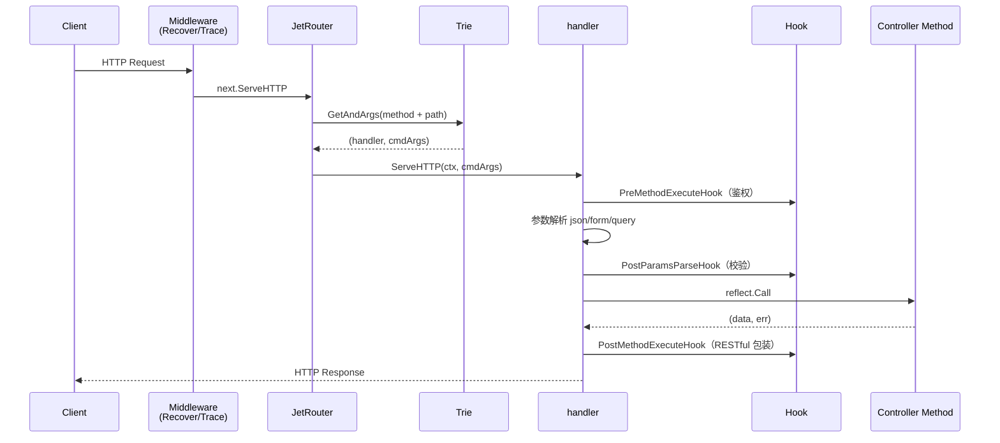

# Jet 🛩

> 一款和 gin 不一样的 Go Web 框架 —— **约定式路由 + 反射绑定 + 依赖注入**，基于 fasthttp。

## ✨ 特性

| 特性 | 说明 |
|------|------|
| 🎯 **约定式路由** | 方法名即路由声明，`GetV1UsageWeek` → `GET /v1/usage/week`，告别繁琐的手动注册 |
| ⚡ **注册期签名固化** | 反射在注册期把方法签名归类为有限组合，运行期零额外反射开销 |
| 🌳 **双层路由优化** | 静态路由走 `map`（O(1)），动态路由走泛型 Trie，`Get` 仅 77 ns/op |
| 💉 **依赖注入** | 基于 `uber/dig`，`init() + Provide` 即可零配置装配整个应用 |
| 🪝 **细粒度 Hook** | 参数解析前/后、方法执行前/后四个切面，接口式低侵入 |
| 🔌 **自动参数绑定** | query / form / json body / uri 路径参数，自动注入到方法签名 |
| 🚀 **高性能** | 基于 fasthttp，QPS 1.2 万+（见性能基准） |
| 🛡 **优雅关闭** | 内建信号监听 + Shutdown，生命周期三段式管理 |

---

## 🏗 架构

Jet 采用 **门面 / 核心 / 工具** 三层结构，单向依赖，符合六边形架构思想。


### 请求处理流程



---

## 🚀 快速开始

### 安装

```bash
go get github.com/fengyuan-liang/jet-web-fasthttp
```

### 最小示例

```go
package main

import (
	"github.com/fengyuan-liang/jet-web-fasthttp/jet"
	"github.com/fengyuan-liang/jet-web-fasthttp/pkg/xlog"
)

func main() {
	xlog.SetOutputLevel(xlog.Ldebug)
	// 中间件：Recover 建议第一个添加，避免 panic 影响其他中间件
	jet.AddMiddleware(jet.RecoverJetMiddleware, jet.TraceJetMiddleware)
	jet.Register(&DemoController{})
	jet.Run(":8080")
}

// DemoController 嵌入 BaseJetController 即可获得
// 参数校验 + RESTful 返回的默认 Hook
type DemoController struct {
	jet.BaseJetController
}

type Person struct {
	Name string `json:"name" form:"name"`
	Age  int    `json:"age" form:"age"`
}

// GetV1Usage0Week 映射为 GET /v1/usage/{id}/week
// 数字 0 是路径参数占位符，实际值会注入到 args.CmdArgs
func (d *DemoController) GetV1Usage0Week(args *jet.Args) (*Person, error) {
	return &Person{Name: "张三", Age: 18}, nil
}
```

运行后：

```bash
$ curl http://localhost:8080/v1/usage/111/week
{"name":"张三","age":18}
```

---

## 📖 核心概念

### 1. 约定式路由

Jet 用 **方法名** 声明路由，无需手动注册。规则：

- **首段大写前缀** → HTTP 动词（`Get` / `Post` / `Put` / `Delete`）
- **剩余驼峰段** → URL 路径（自动转小写、以 `/` 分隔）
- **数字 `0`** → 路径参数占位符，实际值注入到 `args.CmdArgs`

| 方法名 | HTTP 方法 | 路由 |
|--------|-----------|------|
| `GetV1UsageWeek` | GET | `/v1/usage/week` |
| `GetV1Usage0Week` | GET | `/v1/usage/{id}/week` |
| `GetV1UsageWeek0` | GET | `/v1/usage/week/{id}` |
| `PostV1UsageContext` | POST | `/v1/usage/context` |

```go
// GET /v1/usage/111/week  →  args.CmdArgs = ["111"]
func (d *DemoController) GetV1Usage0Week(args *jet.Args) (*Person, error) {
	id := args.CmdArgs[0] // "111"
	// ...
}
```

### 2. 依赖注入

Jet 的几乎所有功能都基于 `uber/dig`。推荐用 `init() + Provide` 把依赖注入贯穿 repo / service / controller 全生命周期：

```go
package main

// 通过空导入触发各层的 init()，自动注册到 Jet
import (
	_ "xxx/apps/xxx/internal/controller"
	_ "xxx/apps/xxx/internal/repo"
	_ "xxx/domain/service"
)

func main() {
	jet.Run(":8080")
}
```

在某层中：

```go
// user_controller.go
func init() {
	jet.Provide(NewUserController)
}

type UserController struct {
	userRepo repo.UserRepo
}

// 构造函数：dig 自动注入 userRepo
func NewUserController(userRepo repo.UserRepo) jet.ControllerResult {
	return jet.NewJetController(&UserController{userRepo: userRepo})
}
```

`jet.ControllerResult` 内部用 `dig.Out` + `group:"server"` 标记，Jet 启动时自动收集所有 Controller。

### 3. Hook 系统

四种 Hook 覆盖 AOP 的「前置 / 环绕 / 后置」语义，**可选实现**，无侵入：

| Hook | 触发时机 | 典型用途 |
|------|----------|----------|
| `PreMethodExecuteHook(ctx)` | 方法执行**前** | 鉴权、链路追踪初始化 |
| `PostParamsParseHook(param)` | 参数解析完成**后** | 参数校验（validator） |
| `PostMethodExecuteHook(data)` | 方法执行**后**、返回前 | RESTful 包装返回值 |
| `PostRouteMountHook()` | 路由挂载**后** | 路由信息收集 |

```go
// 参数校验 Hook
func (d *DemoController) PostParamsParseHook(param any) error {
	if err := utils.Struct(param); err != nil {
		return errors.New(utils.ProcessErr(param, err))
	}
	return nil
}

// RESTful 返回包装 Hook
func (d *DemoController) PostMethodExecuteHook(param any) (data any, err error) {
	return utils.ObjToJsonStr(param), nil
}
```

> 💡 `jet.BaseJetController` 已内置上述两个 Hook 的默认实现，继承即用。

### 4. 中间件

Jet 中间件是「包装器」风格：接收下一个 router，返回新的 router。

> ⚠️ **执行顺序**：**后添加的先执行**。因此 `Recover` 这类兜底中间件建议**第一个**添加，确保它处于调用链最外层。

```go
func main() {
	jet.AddMiddleware(jet.RecoverJetMiddleware, jet.TraceJetMiddleware)
	jet.Register(&DemoController{})
	jet.Run(":8080")
}

// 自定义中间件
func MyMiddleware(next router.IJetRouter) (router.IJetRouter, error) {
	return jet.JetHandlerFunc(func(ctx *fasthttp.RequestCtx) {
		start := time.Now()
		next.ServeHTTP(ctx)
		jet.TraceHttpReq(ctx, start)
	}), nil
}
```

内置中间件：

- `jet.RecoverJetMiddleware` —— panic 兜底，返回 500
- `jet.TraceJetMiddleware` —— 请求计时 + 彩色日志


### 5. 参数绑定

Jet 会根据方法签名 + Content-Type 自动解析参数并注入：

| 来源 | 触发条件 | 注入目标 |
|------|----------|----------|
| Query String | `?key=value` | 结构体 `form` tag 字段 |
| Form | `application/x-www-form-urlencoded` / `multipart/form-data` | 结构体 `form` tag 字段 |
| JSON Body | `application/json` | 结构体 `json` tag 字段 |
| URI 路径 | 路由占位符 `0` | `args.CmdArgs []string` |

```go
type CreateUserReq struct {
	Name string `json:"name" form:"name" validate:"required" reg_err_info:"姓名不能为空"`
	Age  int    `json:"age"  form:"age"`
}

// POST /v1/users
// Content-Type: application/json
// {"name":"张三","age":18}
func (c *UserController) PostV1Users(ctx jet.Ctx, req *CreateUserReq) (*Person, error) {
	ctx.Logger().Infof("create user: %+v", req)
	return &Person{Name: req.Name, Age: req.Age}, nil
}
```

支持的参数组合（最多两个参数，其中可含一个 `jet.Ctx`）：

```
(ctx) → (data, error)
(req) → error
(ctx, req) → (data, error)
(req, ctx) → (data, error)
```

---

## 📊 性能基准

测试环境：`ab -c 400 -n 20000 http://localhost:8081/v1/usage/1111/week`

| 指标 | 数值 |
|------|------|
| QPS | **12041 req/s** |
| 平均延迟（并发 400） | 33.2 ms |
| 最长请求 | 39 ms |
| 失败请求数 | 0 |
| 二进制体积 | **14 MB** |
| 运行时内存 | **6 MB** |


路由树基准（`go test -bench`）：

```
BenchmarkRouterTrie_Add     2824297    425.9 ns/op    113 B/op    2 allocs/op
BenchmarkRouterTrie_Get    14866627     77.9 ns/op     39 B/op    2 allocs/op
BenchmarkRouterTrie_Remove 13333392     84.9 ns/op     63 B/op    2 allocs/op
```

---

## 🗺 路线图

- [ ] **AOP 切面**：前置 / 后置 / 异常 / 环绕 / 最终 五种切面
- [ ] **路由增强**：Controller 自定义路由前缀、命名参数 `:id`、通配符
- [ ] **缓存体系**：一级缓存 + 二级缓存 + 防击穿
- [ ] **Prometheus 集成**：内置 RED 指标
- [ ] **结构化日志**：JSON 输出 + traceId 跨服务传播

---

## 📚 更多

- **完整项目示例**：[AI-Dialogue-Hub/mxclub-server](https://github.com/AI-Dialogue-Hub/mxclub-server)
- **贡献指南**：见 [CONTRIBUTING.md](CONTRIBUTING.md)
- **行为准则**：见 [code-of-conduct.md](code-of-conduct.md)
- **License**：MIT，详见 [LICENSE](LICENSE)

---

> Jet 是一个持续演进的自研框架，欢迎 Issue 与 PR 🎉
