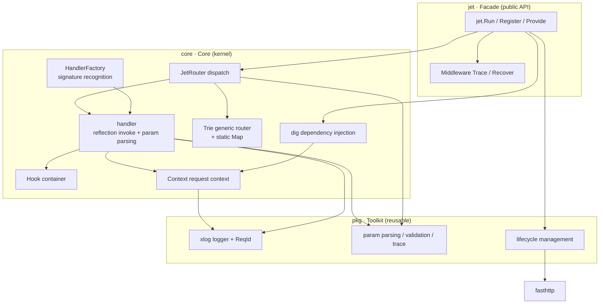
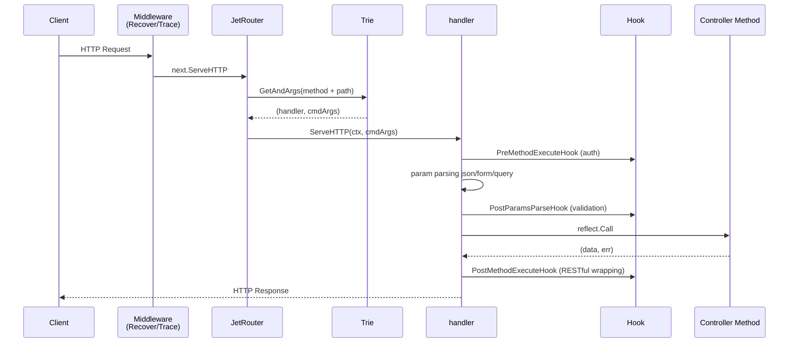

# Jet 🛩

> A Go web framework different from gin — **convention-based routing + reflection binding + dependency injection**, built on fasthttp.

## ✨ Features

| Feature | Description |
|---------|-------------|
| 🎯 **Convention-based Routing** | The method name IS the route: `GetV1UsageWeek` → `GET /v1/usage/week`. No more tedious manual registration. |
| ⚡ **Signature Frozen at Registration** | Reflection classifies method signatures into a finite set at startup; zero extra reflection cost at runtime. |
| 🌳 **Two-tier Routing** | Static routes hit a `map` (O(1)); dynamic routes use a generic Trie. `Get` is only 77 ns/op. |
| 💉 **Dependency Injection** | Powered by `uber/dig`. Wire the whole app with `init() + Provide`. |
| 🪝 **Fine-grained Hooks** | Four pointcuts around param parsing and method execution. Interface-based, non-intrusive. |
| 🔌 **Auto Parameter Binding** | query / form / json body / uri path params are injected into your method signature automatically. |
| 🚀 **High Performance** | Built on fasthttp, 12k+ QPS (see Benchmark). |
| 🛡 **Graceful Shutdown** | Built-in signal handling + Shutdown, three-phase lifecycle. |

---

## 🏗 Architecture

Jet uses a **Facade / Core / Toolkit** three-layer structure with one-way dependencies, following hexagonal architecture principles.



### Request Lifecycle



---

## 🚀 Quick Start

### Install

```bash
go get github.com/fengyuan-liang/jet-web-fasthttp
```

### Minimal Example

```go
package main

import (
	"github.com/fengyuan-liang/jet-web-fasthttp/jet"
	"github.com/fengyuan-liang/jet-web-fasthttp/pkg/xlog"
)

func main() {
	xlog.SetOutputLevel(xlog.Ldebug)
	// Middleware: Recover should be added first so it sits at the outermost layer
	jet.AddMiddleware(jet.RecoverJetMiddleware, jet.TraceJetMiddleware)
	jet.Register(&DemoController{})
	jet.Run(":8080")
}

// DemoController embeds BaseJetController to get
// param validation + RESTful response hooks out of the box
type DemoController struct {
	jet.BaseJetController
}

type Person struct {
	Name string `json:"name" form:"name"`
	Age  int    `json:"age" form:"age"`
}

// GetV1Usage0Week maps to GET /v1/usage/{id}/week
// The digit 0 is a path-param placeholder; its actual value is injected into args.CmdArgs
func (d *DemoController) GetV1Usage0Week(args *jet.Args) (*Person, error) {
	return &Person{Name: "Alice", Age: 18}, nil
}
```

Run it:

```bash
$ curl http://localhost:8080/v1/usage/111/week
{"name":"Alice","age":18}
```

---

## 📖 Core Concepts

### 1. Convention-based Routing

Jet declares routes via **method names** — no manual registration. Rules:

- **Leading uppercase prefix** → HTTP verb (`Get` / `Post` / `Put` / `Delete`)
- **Remaining camel-case segments** → URL path (auto lowercased, split by `/`)
- **The digit `0`** → path-param placeholder; the actual value is injected into `args.CmdArgs`

| Method name | HTTP method | Route |
|-------------|-------------|-------|
| `GetV1UsageWeek` | GET | `/v1/usage/week` |
| `GetV1Usage0Week` | GET | `/v1/usage/{id}/week` |
| `GetV1UsageWeek0` | GET | `/v1/usage/week/{id}` |
| `PostV1UsageContext` | POST | `/v1/usage/context` |

```go
// GET /v1/usage/111/week  →  args.CmdArgs = ["111"]
func (d *DemoController) GetV1Usage0Week(args *jet.Args) (*Person, error) {
	id := args.CmdArgs[0] // "111"
	// ...
}
```

### 2. Dependency Injection

Almost everything in Jet is powered by `uber/dig`. The recommended pattern is to thread DI through the entire lifecycle — repo / service / controller — via `init() + Provide`:

```go
package main

// Blank imports trigger each layer's init() and auto-register with Jet
import (
	_ "xxx/apps/xxx/internal/controller"
	_ "xxx/apps/xxx/internal/repo"
	_ "xxx/domain/service"
)

func main() {
	jet.Run(":8080")
}
```

In a layer:

```go
// user_controller.go
func init() {
	jet.Provide(NewUserController)
}

type UserController struct {
	userRepo repo.UserRepo
}

// Constructor: dig injects userRepo automatically
func NewUserController(userRepo repo.UserRepo) jet.ControllerResult {
	return jet.NewJetController(&UserController{userRepo: userRepo})
}
```

`jet.ControllerResult` is tagged with `dig.Out` + `group:"server"` internally, so Jet collects all controllers automatically at startup.

### 3. Hook System

Four hooks cover the "before / around / after" semantics of AOP. **Optional to implement**, fully non-intrusive:

| Hook | When it fires | Typical use |
|------|---------------|-------------|
| `PreMethodExecuteHook(ctx)` | **Before** method execution | Auth, tracing init |
| `PostParamsParseHook(param)` | **After** param parsing | Validation (validator) |
| `PostMethodExecuteHook(data)` | **After** method, before return | RESTful response wrapping |
| `PostRouteMountHook()` | **After** routes are mounted | Route metadata collection |

```go
// Param validation hook
func (d *DemoController) PostParamsParseHook(param any) error {
	if err := utils.Struct(param); err != nil {
		return errors.New(utils.ProcessErr(param, err))
	}
	return nil
}

// RESTful response wrapper hook
func (d *DemoController) PostMethodExecuteHook(param any) (data any, err error) {
	return utils.ObjToJsonStr(param), nil
}
```

> 💡 `jet.BaseJetController` ships default implementations of the two hooks above — just embed and go.

### 4. Middleware

Jet middleware is "wrapper" style: take the next router, return a new one.

> ⚠️ **Execution order**: the **last added runs first**. That's why a catch-all like `Recover` should be added **first**, so it ends up at the outermost layer of the call chain.

```go
func main() {
	jet.AddMiddleware(jet.RecoverJetMiddleware, jet.TraceJetMiddleware)
	jet.Register(&DemoController{})
	jet.Run(":8080")
}

// Custom middleware
func MyMiddleware(next router.IJetRouter) (router.IJetRouter, error) {
	return jet.JetHandlerFunc(func(ctx *fasthttp.RequestCtx) {
		start := time.Now()
		next.ServeHTTP(ctx)
		jet.TraceHttpReq(ctx, start)
	}), nil
}
```

Built-in middleware:

- `jet.RecoverJetMiddleware` — catches panics, returns 500
- `jet.TraceJetMiddleware` — request timing + colored logging


### 5. Parameter Binding

Jet inspects the method signature + Content-Type and injects parameters automatically:

| Source | Trigger | Target |
|--------|---------|--------|
| Query String | `?key=value` | struct fields with `form` tag |
| Form | `application/x-www-form-urlencoded` / `multipart/form-data` | struct fields with `form` tag |
| JSON Body | `application/json` | struct fields with `json` tag |
| URI Path | route placeholder `0` | `args.CmdArgs []string` |

```go
type CreateUserReq struct {
	Name string `json:"name" form:"name" validate:"required" reg_err_info:"name cannot be empty"`
	Age  int    `json:"age"  form:"age"`
}

// POST /v1/users
// Content-Type: application/json
// {"name":"Alice","age":18}
func (c *UserController) PostV1Users(ctx jet.Ctx, req *CreateUserReq) (*Person, error) {
	ctx.Logger().Infof("create user: %+v", req)
	return &Person{Name: req.Name, Age: req.Age}, nil
}
```

Supported parameter combinations (at most two params, one of which may be `jet.Ctx`):

```
(ctx) → (data, error)
(req) → error
(ctx, req) → (data, error)
(req, ctx) → (data, error)
```

---

## 📊 Benchmark

Environment: `ab -c 400 -n 20000 http://localhost:8081/v1/usage/1111/week`

| Metric | Value |
|--------|-------|
| QPS | **12041 req/s** |
| Mean latency (concurrency 400) | 33.2 ms |
| Longest request | 39 ms |
| Failed requests | 0 |
| Binary size | **14 MB** |
| Runtime memory | **6 MB** |


Router tree benchmark (`go test -bench`):

```
BenchmarkRouterTrie_Add     2824297    425.9 ns/op    113 B/op    2 allocs/op
BenchmarkRouterTrie_Get    14866627     77.9 ns/op     39 B/op    2 allocs/op
BenchmarkRouterTrie_Remove 13333392     84.9 ns/op     63 B/op    2 allocs/op
```

---

## 🗺 Roadmap

- [ ] **AOP**: before / after / exception / around / finally aspects
- [ ] **Routing enhancements**: per-controller route prefix, named params `:id`, wildcards
- [ ] **Caching**: L1 + L2 cache + penetration protection
- [ ] **Prometheus integration**: built-in RED metrics
- [ ] **Structured logging**: JSON output + cross-service traceId propagation

---

## 📚 More

- **Full project example**: [AI-Dialogue-Hub/mxclub-server](https://github.com/AI-Dialogue-Hub/mxclub-server)
- **Contributing**: see [CONTRIBUTING.md](CONTRIBUTING.md)
- **Code of conduct**: see [code-of-conduct.md](code-of-conduct.md)
- **License**: MIT, see [LICENSE](LICENSE)

---

> Jet is a continuously evolving framework. Issues and PRs are welcome 🎉
